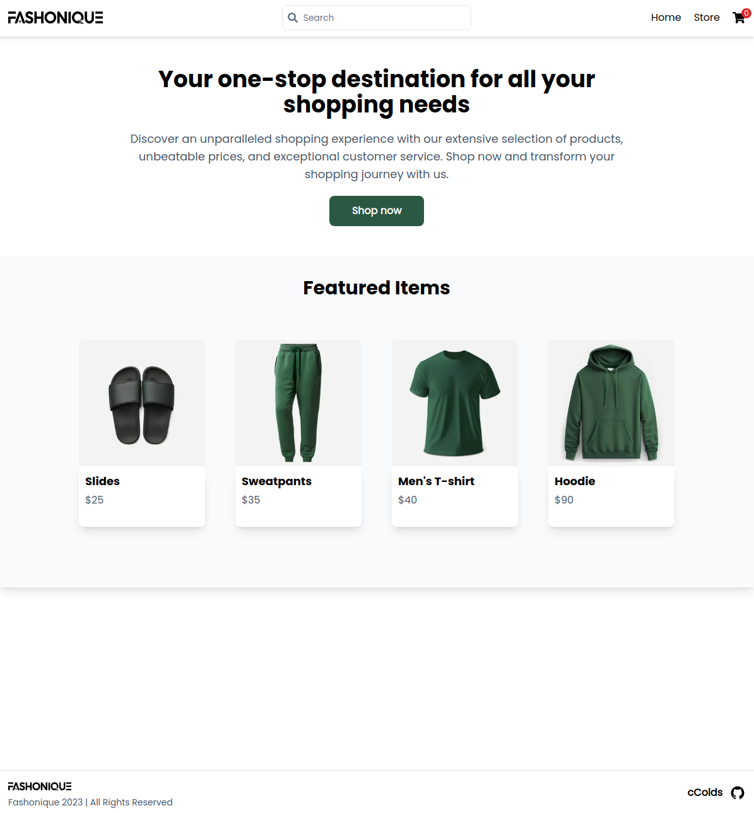

# Shopping Cart

## Description

### A shopping cart app

[Live Preview](https://ccolds.github.io/shopping-cart/)

## Built with

- [React](https://react.dev/)
- [TypeScript](https://www.typescriptlang.org/)
- [Vite](https://vitejs.dev/)
- [React Router](https://reactrouter.com/)
- [TailwindCSS](https://tailwindcss.com/)
- [Mock Shop (API)](https://mock.shop/)
- [React Testing Library](https://testing-library.com/)
- [Jest](https://jestjs.io/)
- [Cloudinary (Image Compressor)](https://cloudinary.com/)

## Thoughts

I used quite a few new tools this project, including TypeScript, Vite, React Router, TailwindCSS, and React Testing Library. Quite an enlightening project!
